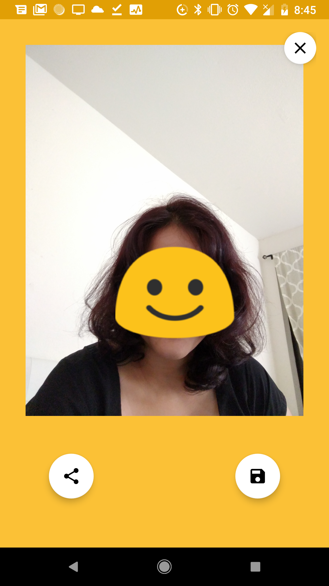

# Emojify
Recognizes and replaces multiple faces from a selfie with Emojis based on facial expressions. Used Google Mobile Vision library for face detection and image processing.
## Libraries
Google Cloud Vision API
## Project Overview
In this Project I have included :
* An activity which gets the required permissions from user and launches camera to take a picture of the user.
* Google Cloud Vision API is used to detect faces and emotions.
* An Emoji is chosen which matches with users emotion detected in the picture and it replaces users face.
## Installation
Clone the GitHub repository.
```
$ git clone https://github.com/sumitasharma/Emojify.git
```
## Application Preview

